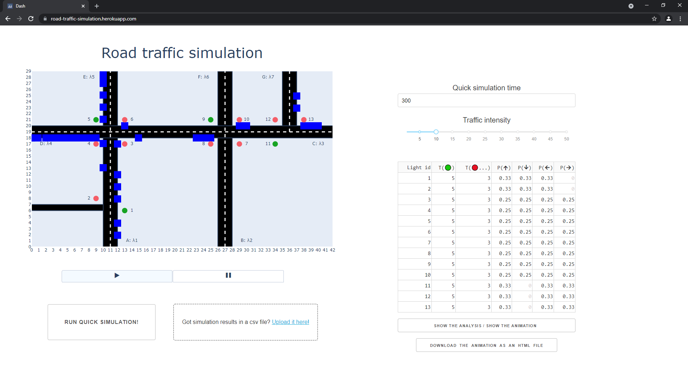
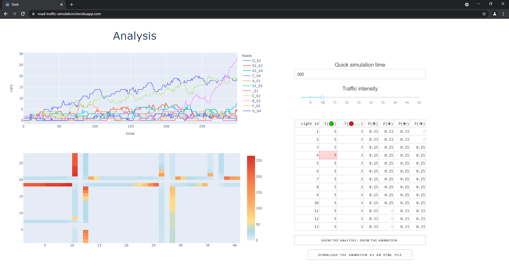

# road-traffic-simulation 🚦🟦🟦🟦
---

### Dash app designed to simulate a fictional road traffic (on a fixed map) based on inhomogeneous Poisson processes.

❯❯❯❯❯  **App deployed on Heroku: https://road-traffic-simulation.herokuapp.com/** *(Note: it may take a while for the app to wake up)*

---

website screenshot

  
---

website screenshot

  
---
  
Each beginning of the road marked with a capital letter generates new cars at the arrival moments¹ of the corresponding inhomogeneous poisson process. Intensity functions of processes are listed below. 
  
* `λ₁(t) = 0.8 + 0.8 * sin(t/2)`

* `λ₂(t) = exp((2 * sin(t/12 + 3) - 0.9)^3)`
 
* `λ₃(t) = 0.5`
  
* `λ₄(t) = 0.7 + 0.6 * sin(t/7 + 2)^2 * cos(t/3 + 1)`
  
* `λ₅(t) = 0.2 + 0.2 * sign(sin(t/24 + 6))`
  
* `λ₆(t) = 0.1 + 0.1 * sin(sqrt(t))`
  
* `λ₇(t) = 0.3 + 0.3 * sin(4 * sin(t/2))`

[¹] One simulation step is one time unit, therefore we cannot generate new cars exactly at the arrivals moments. To keep time discrete, we generate new cars at moments that are the values of the function `F(t) = round(50t / k - 50 / k * t₁)`, where `t` is the exact arrival moment, `t₁` is the first arrival moment and `k` is the global parameter of traffic intensity that can be easily changed with the slider on the page.

---

 ### Parameters
  
For each traffic light, we can change the following parameters
  
*  T(🟢) - green light duration 

* T(🔴) - time until the next green light comes on after the one in question goes out

* P(🢁) - probability of selecting the "up" direction by a passing car. Similarly other directions.
 
 ---
